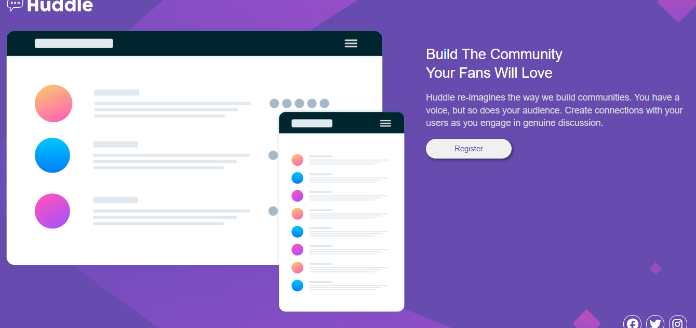

# Huddle Landing Page

A responsive landing page built with **HTML** and **CSS**.  
This page showcases a clean, modern design with an illustration, call-to-action button and social media icons. It is fully responsive for mobile, tablet, and desktop screens.

## Features

- Responsive layout using **CSS Grid** and **media queries**  
- Custom fonts imported from **Google Fonts**  
- Social media icons using **Font Awesome**  
- Hover effects on buttons and icons for interactivity  
- Background images adapt for mobile, tablet, and desktop  

---

## 📸 Preview

---

## 💡 What I Learned

* Structuring responsive layouts
* Working with background images and positioning
* Improving UI consistency and spacing
* Writing cleaner and more readable CSS

---

## 🔗 Live Demo

 

---

## 📂 How to Run

1. Clone the repository
2. Open `index.html` in your browser

---

